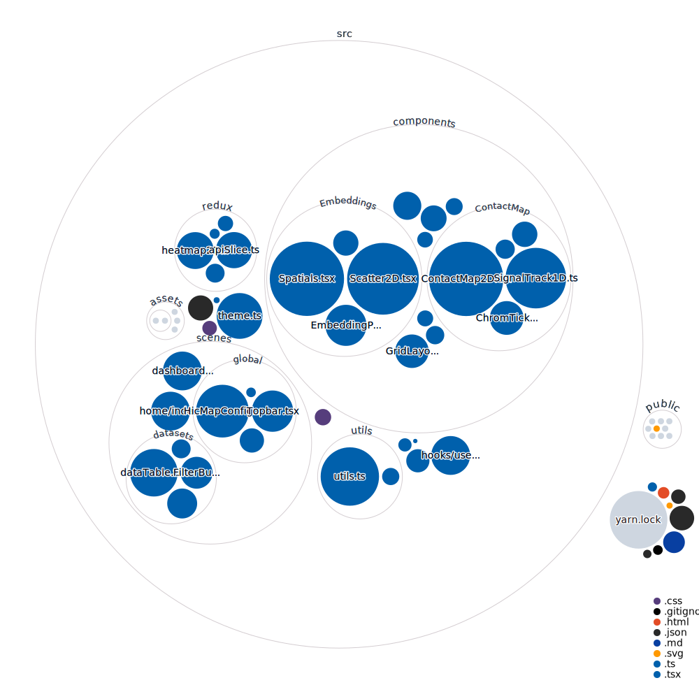

# Single cell HiC Data Visualization and Analysis Tool

A Vite Typescript React project for scHiC data visualization and analysis using Redux, Pixi.js, and D3.js



## Features

- Load and visualize scHiC data in a variety of formats
- Interactively explore and analyze scHiC data through different visualizations
- Visualize data as contact matrices, signal tracls, and scatter plots
- Perform clustering, dimensionality reduction, and other data analysis techniques
- Share and collaborate on data visualizations with others

## Prerequisites

- Node.js `>=v16.17.1`
- Yarn `>=v1.22.19`
- React `^18.2.0`
- Pixi.js `^7.1.0`
- D3 `^7.8.1`

## Installation

### 1. Clone the repository

```bash
git clone https://github.com/<username>/scHiC-data-viz.git
```

### 2. Change into the project directory

```bash
cd scHiC-data-viz
```

#### 3. Install dependencies

```bash
yarn install
```

## Usage

### 1. Start the development server

```bash
yarn run dev
```

### 2. Open your web browser and navigate to <http://localhost:5173>

## Build

To build the production version of the project, run

```bash
yarn build
```

## License

This project is licensed under tthe BSD 3-Clause License - see the [LICENSE](/LICENSE) file for details.
